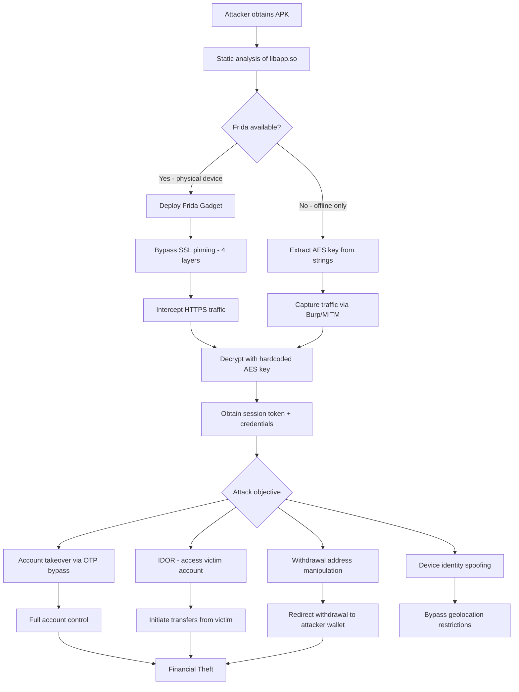

# Attack Flow Diagrams

## 1. Full Attack Chain



---

## 2. Encryption Layer Bypass

```
┌──────────────────────────────────────────────────────────┐
│              4-LAYER ENCRYPTION BREACH                   │
│                                                          │
│  ┌─────────────────────────────────────────────────┐    │
│  │ LAYER 4: AES-256-ECB                           │    │
│  │ Key: keyhead_project_xhui_one_keytail          │    │
│  │ Bypass: Static extraction from libapp.so       │    │
│  │                    ▼                           │    │
│  │ ┌─────────────────────────────────────────┐   │    │
│  │ │ LAYER 3: NDK ECDH (ECC P-256)          │   │    │
│  │ │ Bypass: Frida hook on native function  │   │    │
│  │ │                    ▼                   │   │    │
│  │ │ ┌─────────────────────────────────┐   │   │    │
│  │ │ │ LAYER 2: EncryptedSharedPrefs  │   │   │    │
│  │ │ │ Bypass: Key extracted from L3  │   │   │    │
│  │ │ │                    ▼           │   │   │    │
│  │ │ │ ┌─────────────────────────┐   │   │   │    │
│  │ │ │ │ LAYER 1: FlutterSecure │   │   │   │    │
│  │ │ │ │ Bypass: KeyStore hook  │   │   │   │    │
│  │ │ │ │                        │   │   │   │    │
│  │ │ │ │  ★ PLAINTEXT ACCESS ★  │   │   │   │    │
│  │ │ │ └─────────────────────────┘   │   │   │    │
│  │ │ └─────────────────────────────────┘   │   │    │
│  │ └─────────────────────────────────────────┘   │    │
│  └─────────────────────────────────────────────────┘    │
└──────────────────────────────────────────────────────────┘
```

---

## 3. Blockchain C2 Architecture

```
┌─────────────────────────────────────────────────────────┐
│                  HUIONE PAY APP                         │
│                                                         │
│  On startup:                                            │
│  eth_call(0xe9d5f...feb0, getUrl())                    │
│           │                                             │
│           ▼                                             │
│  BSC Smart Contract                                     │
│  ┌──────────────────────────────────────────┐          │
│  │ 0xe9d5f645f79fa60fca82b4e1d35832e43370f │          │
│  │ Storage slot 0: "https://8kwfaa30jt..."  │          │
│  │ Owner: 0x849008a6...                     │          │
│  └──────────────┬───────────────────────────┘          │
│                 │ Returns C2 URL                        │
│                 ▼                                       │
│  Connect to: https://8kwfaa30jtlnwi.com                │
│           │                                             │
│           ▼                                             │
│  → Cloudflare → Backend infrastructure                  │
└─────────────────────────────────────────────────────────┘

Benefit for attacker:
  - URL stored immutably on blockchain
  - Cannot be seized by domain registrar
  - Only contract owner (0x849008...) can update
  - App automatically uses new URL without update
```

---

## 4. IDOR Account Manipulation

```
NORMAL FLOW:
  User A (ID: 3481132) ──→ POST /createTransfer ──→ fromAccountId: 3481132 ──→ OK

IDOR ATTACK:
  Attacker (ID: 3481132) ──→ POST /createTransfer
                              fromAccountId: 3481134  ← victim ID
                              amount: 10000 USDH
                              ▼
                         Server checks: balance of 3481134 ← WRONG! Should check ownership
                              ▼
                         If victim has funds → Transfer authorized ← BUG
```

---

## 5. Infrastructure Map

```
                    ┌──────────────────────────┐
                    │     HUIONE GROUP         │
                    │   (Cambodia-based)       │
                    └────────────┬─────────────┘
                                 │
              ┌──────────────────┼──────────────────┐
              │                  │                  │
   ┌──────────▼──────┐  ┌────────▼───────┐  ┌──────▼────────┐
   │  API Layer      │  │  Blockchain    │  │  Real-time    │
   │                 │  │                │  │  Data         │
   │ app.hh3721.com  │  │ Huione Chain   │  │               │
   │ (CloudFront)    │  │ rpc.huione.org │  │ wss-mqtt.     │
   │                 │  │                │  │ xone.la       │
   │ Direct fallback:│  │ BSC C2:        │  │               │
   │ 8.217.236.122   │  │ 0xe9d5f...     │  │ 4383 msg/15s  │
   └─────────────────┘  └────────────────┘  └───────────────┘
              │
   ┌──────────▼──────────────────┐
   │     S3 Configuration        │
   │ datadogips.s3.amazonaws.com │
   │ (Publicly readable!)        │
   └─────────────────────────────┘
```
